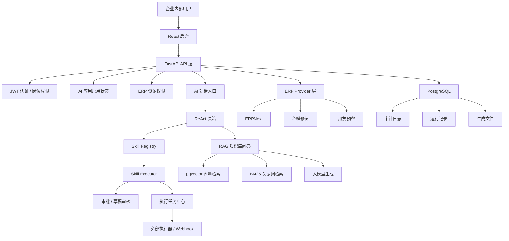

# AI automated back-end management system

面向企业内部岗位的 AI 自动化后台管理系统。项目为一个更完整的企业 AI 自动化后台：员工可以通过 AI 对话、岗位自动化、知识库检索和 ERP 查询减少重复操作；管理员可以统一管理用户、岗位权限、AI 应用开关、自动化流程、审批、执行任务、运行记录、审计日志和效果分析。


## 项目定位

传统企业后台里，客服、运营、财务经常需要重复处理订单查询、ERP查询、客服回复、工资导出、Excel 整理、财务对账、退款审批和文件下载等工作。本项目把这些高频业务动作抽象成可控的 AI 能力，并通过后端权限、审批、审计和执行器机制保证自动化过程可追踪、可拦截、可回滚。


## 核心功能

- 岗位化后台：支持管理员、运营、客服、财务等不同岗位入口和权限范围。
- AI 对话工作台：支持流式聊天、上下文记忆、会话历史、RAG 问答、ERP 查询和自动化意图分流。
- Skill 架构：将运营 Listing、客服回复、财务工资导出、财务 Excel 生成、财务对账等能力沉淀到 `app/skills/`。
- 业务动作闭环：AI 生成草稿后进入草稿审核、外部执行任务、执行回调、通知和审计链路。
- 客服自动化：客服消息收件箱、智能回复草稿、自动处理建议、退款审批和多语言回复场景。
- 运营自动化：Listing 上架准备、标题、五点描述、关键词、促销文案和竞品分析。
- 财务自动化：财务报表分析、工资导出、Excel 整理生成、财务对账和生成文件下载。
- RAG 知识库：支持多格式文档上传、向量检索、BM25、混合召回、rerank、字段级和团队级权限控制。
- ERP 集成层：支持 ERPNext，并预留金蝶、用友 Provider 扩展入口。
- 管理员治理：用户管理、AI 应用权限、流程配置、连接器中心、外部执行器配置、监控中心、效果分析、AI 评测中心和审计日志。
- 非技术岗位可视化：把草稿、执行任务、审批、业务动作状态等后台信息转成客服、运营、财务能理解的业务视图。

## 技术栈

- 后端：FastAPI、Pydantic、psycopg、JWT
- AI 编排：LangChain、LangGraph、ReAct 决策服务
- 大模型：阿里百炼 / DashScope OpenAI compatible API
- RAG：PostgreSQL + pgvector、BM25、jieba、rerank、LangChain Text Splitters
- 前端：React、Vite、TypeScript
- 自动化集成：Webhook、外部执行器、MCP 预留、飞书集成预留
- 部署：Docker Compose、PostgreSQL、pgvector

## 架构图



## Skill 架构

自动化能力按 Skill 组织，Skill 负责描述业务能力和调用入口，安全执行仍由后端权限、审批和审计保障。

```text
app/skills/
  registry.py
  executor.py
  operations_listing/
    SKILL.md
    executor.py
  customer_reply/
    SKILL.md
    executor.py
  finance_salary_export/
    SKILL.md
    executor.py
  finance_excel_settlement/
    SKILL.md
    executor.py
  finance_reconciliation/
    SKILL.md
    executor.py
```

Skill 执行前会统一检查：

- 当前用户是否登录
- 当前岗位是否允许使用该能力
- AI 应用是否启用
- ERP 资源是否在岗位授权范围内
- 是否需要人工审批
- 是否需要记录运行日志和审计日志

## 目录结构

```text
app/
  api/                 后端接口：认证、用户、自动化、ERP、审批、审计、文件、通知
  agents/              低风险 Agent 工具调用入口
  auth/                JWT、密码哈希、当前用户解析
  erp/                 ERPNext / 金蝶 / 用友 Provider 抽象
  graph/               LangGraph 业务工作流
  rag/                 文档加载、切分、向量入库、混合检索、问答
  services/            业务服务、权限、自动化、审批、执行任务、运行记录
  skills/              Skill Registry 和各岗位 Skill executor
  tools/               订单、知识库、审批等工具入口
frontend/
  src/                 React + Vite 后台前端
scripts/               种子数据、验证脚本、评测脚本
docs/                  spec、变更记录、安全清单和测试策略
sql/                   数据库 schema 和迁移 SQL
eval/                  RAG 评测集
data/                  本地生成文件和临时数据
```

## 本地启动

### 方式一：Docker Compose 启动后端和数据库

1. 准备环境变量：

```bash
cp .env.example .env
```

至少需要配置：

```text
DASHSCOPE_API_KEY=your_dashscope_api_key
JWT_SECRET_KEY=replace_with_a_long_random_secret
```

如需真实连接 ERPNext，再配置：

```text
ERP_PROVIDER=erpnext
ERP_BASE_URL=http://127.0.0.1:8080
ERP_API_KEY=your_erpnext_api_key
ERP_API_SECRET=your_erpnext_api_secret
```

2. 启动服务：

```bash
docker compose up --build
```

服务地址：

```text
API: http://127.0.0.1:8001
Swagger: http://127.0.0.1:8001/docs
PostgreSQL: localhost:5433
```

3. 初始化演示数据和密码：

```bash
docker compose exec api python scripts/seed_data.py
docker compose exec api python scripts/set_password.py
```

### 方式二：本机启动后端

```bash
python -m venv .venv
source .venv/bin/activate
pip install -r requirements.txt
docker compose up -d postgres
uvicorn app.main:app --reload --port 8001
```

### 启动前端

另开一个终端：

```bash
cd frontend
npm install
npm run dev
```

前端地址：

```text
http://127.0.0.1:5173
```

前端开发服务会把 `/api` 代理到 `http://127.0.0.1:8001`。

## 演示账号

初始化数据后可使用：

```text
管理员：admin_demo / Admin123456
运营：operations_demo / Operations123456
客服：employee_demo / Employee123456
财务：finance_demo / Finance123456
```

不同账号登录后，左侧导航、AI 应用、ERP 资源、自动化入口和审批能力会按岗位自动过滤。

## 常用接口

### 登录

```bash
curl -X POST "http://127.0.0.1:8001/auth/login" \
  -H "Content-Type: application/x-www-form-urlencoded" \
  -d "username=admin_demo&password=Admin123456"
```

### AI 流式对话

```bash
curl -N -X POST "http://127.0.0.1:8001/chat/stream" \
  -H "Authorization: Bearer <TOKEN>" \
  -H "Content-Type: application/json" \
  -d '{"message":"帮我生成这个商品的 Listing 上架草稿"}'
```

SSE 事件类型：

```text
start    开始处理
node     节点执行进度
content  最终答案分块
done     完成，包含完整答案和业务字段
error    错误信息
```

### 上传知识库文档

```bash
curl -X POST "http://127.0.0.1:8001/admin/documents/upload" \
  -H "Authorization: Bearer <ADMIN_TOKEN>" \
  -F "file=@docs/refund.md" \
  -F "visibility=employee"
```

### 查询会话记录

```bash
curl "http://127.0.0.1:8001/threads/<THREAD_ID>/messages" \
  -H "Authorization: Bearer <TOKEN>"
```

### 查看自动化运行记录

```bash
curl "http://127.0.0.1:8001/run-records" \
  -H "Authorization: Bearer <ADMIN_TOKEN>"
```

## 验证与测试

快速验证：

```bash
make verify-quick
```

API 验证：

```bash
make verify-api
```

发布前验证：

```bash
make verify-release
```

前端构建：

```bash
npm --prefix frontend run build
```

RAG 评测：

```bash
python -m scripts.evaluate_rag
```

## 安全设计

- 登录态使用 JWT。
- 管理员和员工角色分离。
- 员工按岗位过滤 AI 应用、ERP 资源和后台页面。
- RAG 检索会检查文档可见范围、团队授权、字段分类和敏感级别。
- 自动化执行前检查岗位、AI 应用启用状态和 ERP 资源权限。
- 高风险动作进入审批或草稿审核，不由大模型直接执行。
- 外部执行器支持 allowlist、签名、回调密钥和审计日志。
- 运行记录和审计日志用于追踪每次 AI 调用、工具调用和业务动作。

## 项目亮点

- 从单一 RAG 问答升级成企业 AI 自动化后台管理系统。
- 将自动化能力 Skill 化，扩展新岗位和新业务动作只需要添加新的Skill。
- 用 ReAct 做能力选择，但用后端权限、审批和审计保证安全执行。
- 同时覆盖运营、客服、财务三个非技术岗位的真实业务场景。
- 把 JSON、执行状态和技术细节转成业务人员可理解的可视化视图。
- 使用 PostgreSQL 同时承载业务数据、审计数据和 pgvector 向量检索，降低本地部署复杂度。
- 提供真实浏览器验证脚本、API 验证脚本和 RAG 评测入口，便于测试项目完整度。

## 后续计划

- 接入更多真实企业系统，例如飞书、钉钉、电商、邮箱、客服系统和财务系统。
- 完善外部执行器市场，让 n8n、影刀、自研 webhook 都能作为执行端。
- 增加更多岗位模板，例如人事、销售、采购和仓储。
- 优化 ReAct 误判处理，包括置信度阈值、追问、多模型复核和自动化回滚。
- 给复杂自动化完善Plan-and-Execute，为需要高质量文案岗位加入Reflection
- 增强前端可视化，把更多技术字段转换成业务人员可直接理解的卡片、流程图和表格。
