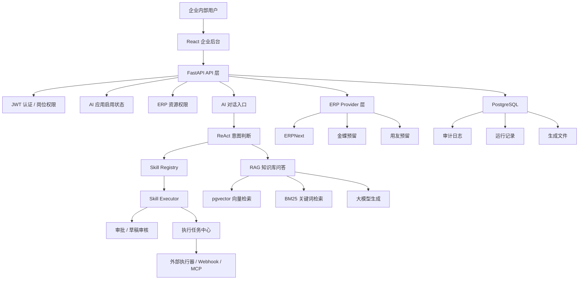

# AI automated back-end management system

面向企业内部岗位的 AI 自动化后台管理系统。项目重点不是做一个普通聊天机器人，而是把企业里客服、运营、财务经常重复处理的工作，变成可控、可审计、可审批、可追踪的 AI 自动化能力。

这个项目适合用于 **AI 应用开发 + 企业自动化平台** 方向的面试展示。

## 面试展示重点

10-15 分钟演示时，建议重点讲这几个能力：

- **AI 自动化**：用户用自然语言提出业务需求，系统识别意图并调用对应自动化能力。
- **Skill 架构**：运营、客服、财务能力收敛到 `app/skills/`，新增自动化可以按统一格式扩展。
- **ReAct + 后端安全执行**：大模型负责判断“可能要调用哪个能力”，真正执行由后端做权限、ERP、审批和审计校验。
- **ERPNext 集成**：AI 可以查询 ERPNext 的订单、客户、工资、发票、收付款、总账等信息。
- **财务自动化**：支持财务报表、工资表、Excel 处理、对账和生成文件下载。
- **业务闭环**：AI 生成草稿后进入审核、外部执行、运行记录和审计，不让大模型直接越权执行。
- **非技术岗位业务视图**：客服、运营、财务不看 JSON，而是看卡片、表格、金额摘要、审批状态和下一步操作。
- **管理员治理**：用户、岗位权限、AI 应用开关、连接器、流程版本、运行记录、监控和评测统一管理。

## 10-15 分钟演示路径

推荐按这个顺序演示，不需要每个页面都讲很细：

1. 登录财务账号，展示员工只看到自己岗位相关能力。
2. 在 AI 对话中发送类似“帮我生成这个月的财务报表和工资表”的需求。
3. 展示 AI 识别财务自动化意图，并生成可下载文件。
4. 打开生成文件中心，展示报表、工资表、金额摘要和下载入口。
5. 切换管理员账号，打开运行记录，展示业务时间线、产物证据、ERP 引用和审批安全。
6. 展示 ERP 工作台或岗位首页，说明 ERPNext 数据如何按岗位权限读取。
7. 展示 Skill 架构目录，说明新增自动化能力的扩展方式。
8. 展示员工访问管理员运行记录会被拒绝，说明权限闸门不是前端假隐藏。

## Demo 账号

初始化演示数据后可使用：

```text
管理员：admin_demo / Admin123456
运营：operations_demo / Operations123456
客服：employee_demo / Employee123456
财务：finance_demo / Finance123456
```

这些账号只用于演示环境，不要把真实生产密钥、真实客户数据或真实工资数据提交到仓库。

## 一键演示健康检查

本项目提供面试前检查脚本，适合本地或云服务器公网演示前运行。

本地检查：

```bash
python3 scripts/verify_demo_readiness.py \
  --api-base-url http://127.0.0.1:8001 \
  --frontend-url http://127.0.0.1:5173
```

云服务器公网检查：

```bash
python3 scripts/verify_demo_readiness.py \
  --api-base-url http://服务器公网IP:8001 \
  --frontend-url http://服务器公网IP:5173
```

如果前端已经通过 Nginx 暴露在 80 端口：

```bash
python3 scripts/verify_demo_readiness.py \
  --api-base-url http://服务器公网IP:8001 \
  --frontend-url http://服务器公网IP
```

输出 JSON 方便接入发布脚本：

```bash
python3 scripts/verify_demo_readiness.py --json
```

脚本会检查：

- API `/health`
- Swagger `/docs`
- 前端页面是否可访问
- 四个 demo 账号是否能登录
- `/auth/me` 是否能返回正确角色和岗位
- 财务账号是否能查看 ERP 状态和 ERP 资源
- 财务账号是否能看到 AI 工作流列表
- 管理员是否能查看运行记录
- 运营、客服、财务访问运行记录是否返回 403

ERPNext 未连接时，脚本会给出 warning，而不是直接失败。这样面试前你能快速知道问题是“系统没启动”“账号没初始化”，还是“ERPNext 连接需要修”。

## 核心功能

- 岗位化后台：管理员、运营、客服、财务拥有不同导航、AI 应用、ERP 资源和操作权限。
- AI 对话工作台：支持流式聊天、上下文、会话历史、RAG 问答、ERP 查询和自动化意图分流。
- Skill 架构：将运营 Listing、客服回复、财务工资导出、财务 Excel 生成、财务对账等能力沉淀到 `app/skills/`。
- 财务复合资料生成：用户同时要求财务报表和工资表时，系统按意图生成多份资料，不会只返回其中一种。
- 业务动作闭环：AI 草稿进入审核、外部执行任务、回调、通知和审计链路。
- 客服自动化：客服消息收件箱、智能回复草稿、风险识别、退款审批、多语言回复。
- 运营自动化：Listing 上架准备、标题、五点描述、关键词、促销文案和竞品分析。
- 财务自动化：财务报表分析、工资导出、Excel 整理、财务对账和生成文件下载。
- RAG 知识库：文档上传、向量检索、BM25、混合召回、rerank、字段级和团队级权限控制。
- PDF 解析增强：默认优先使用 MinerU 解析复杂 PDF，失败时自动回退到 PyPDFLoader；可通过 `RAG_PDF_PARSER` 切换为 `auto` / `mineru` / `pypdf`。
- ERP 集成层：当前支持 ERPNext，并预留金蝶、用友 Provider 扩展入口。
- 管理员治理：用户管理、AI 应用权限、流程配置、连接器中心、MCP 工具、监控中心、效果分析、AI 评测中心和审计日志。
- 非技术岗位可视化：把 JSON、metadata、payload、运行步骤转成业务人员能理解的业务卡片、表格和时间线。

## 技术栈

- 后端：FastAPI、Pydantic、psycopg、JWT
- AI 编排：LangChain、LangGraph、ReAct 决策服务
- 大模型：阿里百炼 / DashScope OpenAI compatible API
- RAG：PostgreSQL + pgvector、BM25、jieba、rerank、LangChain Text Splitters、MinerU PDF 解析增强
- 前端：React、Vite、TypeScript、Ant Design Pro
- 自动化集成：Skill Executor、Webhook、外部执行器、MCP 工具层预留、企业微信发送能力
- 部署：Docker Compose、PostgreSQL、pgvector、云服务器公网访问

## 架构图



## Skill 架构

自动化能力按 Skill 组织。Skill 负责描述能力，真正安全执行仍由后端统一入口控制。

```text
app/skills/
  registry.py
  executor.py
  operations_listing/
    SKILL.md
    executor.py
  customer_reply/
    SKILL.md
    executor.py
  finance_salary_export/
    SKILL.md
    executor.py
  finance_excel_settlement/
    SKILL.md
    executor.py
  finance_reconciliation/
    SKILL.md
    executor.py
  finance_compound_report_generation/
    SKILL.md
    executor.py
```

Skill 执行前会统一检查：

- 当前用户是否登录
- 当前岗位是否允许使用该能力
- AI 应用是否启用
- ERP 资源是否在岗位授权范围内
- 是否需要人工审批
- 是否需要记录运行日志和审计日志

## 目录结构

```text
app/
  api/                 后端接口：认证、用户、自动化、ERP、审批、审计、文件、通知
  auth/                JWT、密码哈希、当前用户解析
  erp/                 ERPNext / 金蝶 / 用友 Provider 抽象
  graph/               LangGraph 业务工作流
  rag/                 文档加载、切分、向量入库、混合检索、问答
  services/            业务服务、权限、自动化、审批、执行任务、运行记录
  skills/              Skill Registry 和各岗位 Skill executor
  tools/               订单、知识库、审批等工具入口
frontend/
  src/                 React + Vite 后台前端
scripts/               种子数据、验证脚本、评测脚本和演示健康检查
docs/                  spec、变更记录、安全清单和测试策略
sql/                   数据库 schema 和迁移 SQL
eval/                  RAG 评测集
data/                  本地生成文件和临时数据
```

## 本地启动

### 方式一：Docker Compose 启动后端和数据库

1. 准备环境变量：

```bash
cp .env.example .env
```

至少需要配置：

```text
DASHSCOPE_API_KEY=your_dashscope_api_key
JWT_SECRET_KEY=replace_with_a_long_random_secret
```

如需真实连接 ERPNext，再配置：

```text
ERP_PROVIDER=erpnext
ERP_BASE_URL=http://127.0.0.1:8080
ERP_API_KEY=your_erpnext_api_key
ERP_API_SECRET=your_erpnext_api_secret
```

2. 启动后端和数据库：

```bash
docker compose up --build
```

服务地址：

```text
API: http://127.0.0.1:8001
Swagger: http://127.0.0.1:8001/docs
PostgreSQL: localhost:5433
```

3. 初始化演示数据和密码：

```bash
docker compose exec api python scripts/seed_data.py
docker compose exec api python scripts/set_password.py
```

### 方式二：本机启动后端

```bash
python -m venv .venv
source .venv/bin/activate
pip install -r requirements.txt
docker compose up -d postgres
uvicorn app.main:app --reload --port 8001
```

### 启动前端

另开一个终端：

```bash
cd frontend
npm install
npm run dev
```

前端地址：

```text
http://127.0.0.1:5173
```

前端开发服务会把 `/api` 代理到 `http://127.0.0.1:8001`。

## 云服务器公网演示

常见演示方式：

- 后端 API：`http://服务器公网IP:8001`
- 前端页面：`http://服务器公网IP:5173`
- ERPNext：可以单独跑在服务器或另一台服务上，通过 `.env` 的 `ERP_BASE_URL` 配置。

云服务器需要开放端口：

```text
8001  后端 API
5173  前端演示服务，或使用 Nginx 暴露 80
ERPNext 对应端口，按你的实际部署配置
```

演示前建议先跑：

```bash
python3 scripts/verify_demo_readiness.py \
  --api-base-url http://服务器公网IP:8001 \
  --frontend-url http://服务器公网IP:5173
```

如果这个脚本通过，说明账号、后端、前端、ERP 状态、AI 应用列表和权限闸门都处于可演示状态。

## 常用接口

### 登录

```bash
curl -X POST "http://127.0.0.1:8001/auth/login" \
  -H "Content-Type: application/x-www-form-urlencoded" \
  -d "username=admin_demo&password=Admin123456"
```

### AI 流式对话

```bash
curl -N -X POST "http://127.0.0.1:8001/chat/stream" \
  -H "Authorization: Bearer <TOKEN>" \
  -H "Content-Type: application/json" \
  -d '{"message":"帮我生成这个月的财务报表和工资表"}'
```

### ERP 状态

```bash
curl "http://127.0.0.1:8001/erp/status" \
  -H "Authorization: Bearer <TOKEN>"
```

### 查看运行记录

```bash
curl "http://127.0.0.1:8001/run-records" \
  -H "Authorization: Bearer <ADMIN_TOKEN>"
```

## 验证与测试

面试演示健康检查：

```bash
python3 scripts/verify_demo_readiness.py
```

快速验证：

```bash
make verify-quick
```

API 验证：

```bash
make verify-api
```

发布前验证：

```bash
make verify-release
```

前端构建：

```bash
npm --prefix frontend run build
```

RAG 评测：

```bash
python -m scripts.evaluate_rag
```

## 安全设计

- 登录态使用 JWT。
- 管理员和员工角色分离。
- 员工按岗位过滤 AI 应用、ERP 资源和后台页面。
- RAG 检索会检查文档可见范围、团队授权、字段分类和敏感级别。
- 自动化执行前检查岗位、AI 应用启用状态和 ERP 资源权限。
- 高风险动作进入审批或草稿审核，不由大模型直接执行。
- 外部执行器支持 allowlist、签名、回调密钥和审计日志。
- 运行记录和审计日志用于追踪每次 AI 调用、工具调用和业务动作。
- 非技术岗位默认不展示 raw JSON、metadata、payload 和技术详情。

## 项目亮点

- 从单一 RAG 问答升级成企业 AI 自动化后台管理系统。
- 将自动化能力 Skill 化，扩展新岗位和新业务动作可以按统一结构添加。
- 用 ReAct 做能力选择，但用后端权限、审批和审计保证安全执行。
- 同时覆盖运营、客服、财务三个非技术岗位的真实业务场景。
- 把 JSON、执行状态和技术细节转成业务人员可理解的可视化视图。
- 使用 PostgreSQL 同时承载业务数据、审计数据和 pgvector 向量检索。
- 提供真实浏览器验证脚本、API 验证脚本、RAG 评测入口和面试演示健康检查脚本。

## 后续计划

- 接入更多真实企业系统，例如飞书、钉钉、电商平台、邮箱、客服系统和财务系统。
- 完善外部执行器市场，让 n8n、影刀、自研 webhook 都能作为执行端。
- 增加更多岗位模板，例如人事、销售、采购和仓储。
- 优化 ReAct 误判处理，包括置信度阈值、追问、多模型复核和自动化回滚。
- 给复杂自动化完善 Plan-and-Execute，为高质量文案岗位加入 Reflection。
