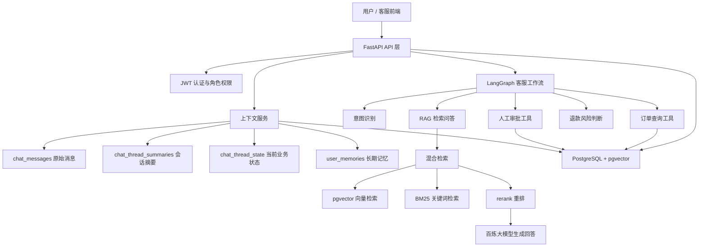
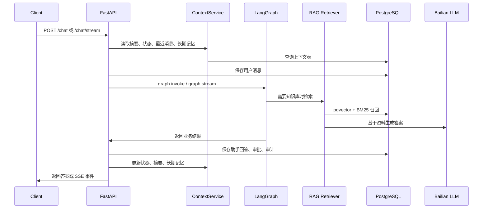

# Company RAG Agent

企业客服 RAG + LangGraph Agent 智能问答系统。项目模拟公司内部客服场景，支持知识库问答、订单查询、退款审批、权限过滤、审计日志、上下文记忆和流式聊天。

## 核心能力

- RAG 知识库问答：支持 txt、md、pdf、docx、csv、xlsx、xls 上传并向量化入库。
- 高级检索：向量检索、BM25 关键词检索、混合召回、rerank、多 query、父子文档检索、相似度阈值拒答。
- LangGraph 业务编排：意图识别、订单号抽取、订单查询、退款风险判断、人工审批、答案生成。
- 企业权限：JWT 登录、admin / employee 角色控制、department 部门过滤。
- 上下文记忆：原始聊天记录、会话摘要、当前业务状态、用户长期记忆、过期清理。
- 审计与审批：审批记录、退款流水、操作审计日志。
- SSE 流式聊天：`/chat/stream` 返回节点进度和最终答案分块。

## 技术栈

- 后端：FastAPI、Pydantic、psycopg、JWT
- AI 编排：LangChain、LangGraph
- 大模型：阿里百炼 / DashScope OpenAI compatible API
- 向量数据库：PostgreSQL + pgvector
- 检索：PGVector、rank-bm25、jieba、LangChain Text Splitters
- 前端：React + Vite，当前为产品页面雏形，后续接真实接口
- 部署：Docker Compose

## 架构图



## 请求流程



## 目录结构

```text
app/
  api/                 管理接口：审批、退款、审计、会话历史、认证
  agents/              低风险 Agent 工具调用入口
  auth/                JWT、密码哈希、当前用户解析
  graph/               LangGraph 业务工作流
  rag/                 文档加载、切分、向量入库、混合检索、问答
  services/            审批、退款、日志、上下文记忆服务
  tools/               订单、知识库、审批工具
scripts/               种子数据、密码设置、上下文清理脚本
eval/                  RAG 评测集
sql/                   数据库 schema 和迁移 SQL
frontend/              React 产品页面雏形
```

## 本地启动

### 方式一：Docker Compose 一键启动

1. 准备环境变量：

```bash
cp .env.example .env
```

把 `.env` 里的 `DASHSCOPE_API_KEY` 和 `JWT_SECRET_KEY` 改成自己的值。

2. 启动数据库和后端：

```bash
docker compose up --build
```

服务地址：

- API: http://127.0.0.1:8001
- Swagger: http://127.0.0.1:8001/docs
- PostgreSQL: localhost:5433

3. 初始化演示数据：

另开一个终端执行：

```bash
docker compose exec api python scripts/seed_data.py
docker compose exec api python scripts/set_password.py
```

演示账号：

```text
admin_demo / Admin123456
employee_demo / Employee123456
```

### 方式二：本机 Python 启动

```bash
python -m venv .venv
source .venv/bin/activate
pip install -r requirements.txt
uvicorn app.main:app --reload --port 8001
```

如果只启动数据库：

```bash
docker compose up -d postgres
```

## 常用接口

### 登录

```bash
curl -X POST "http://127.0.0.1:8001/auth/login" \
  -H "Content-Type: application/x-www-form-urlencoded" \
  -d "username=employee_demo&password=Employee123456"
```

### 普通聊天

```bash
curl -X POST "http://127.0.0.1:8001/chat" \
  -H "Authorization: Bearer <TOKEN>" \
  -H "Content-Type: application/json" \
  -d '{"message":"订单10086可以退款吗？"}'
```

### SSE 流式聊天

```bash
curl -N -X POST "http://127.0.0.1:8001/chat/stream" \
  -H "Authorization: Bearer <TOKEN>" \
  -H "Content-Type: application/json" \
  -d '{"message":"订单10086可以退款吗？"}'
```

事件类型：

```text
start    开始处理
node     LangGraph 节点执行进度
content  最终答案分块
done     完成，包含完整答案和业务字段
error    错误信息
```

### 上传知识库文档

```bash
curl -X POST "http://127.0.0.1:8001/admin/documents/upload" \
  -H "Authorization: Bearer <ADMIN_TOKEN>" \
  -F "file=@docs/refund.md" \
  -F "visibility=employee"
```

### 查询历史会话上下文

```bash
curl "http://127.0.0.1:8001/threads/<THREAD_ID>/messages" \
  -H "Authorization: Bearer <TOKEN>"
```

返回内容包含：

- `thread`：会话基本信息
- `summary`：会话摘要
- `state`：当前业务状态
- `memories`：用户长期记忆
- `messages`：原始消息列表

### RAG 评测

默认评测集在 `eval/rag_eval_set.jsonl`，运行：

```bash
python -m scripts.evaluate_rag
```

输出指标：

```text
hit@5           top5 里是否至少命中一个正确证据
Recall@5        top5 里命中的正确证据数 / 该问题全部正确证据数
MRR             第一个正确证据排名的倒数平均值
拒答准确率       应该拒答的问题里，模型是否回答“资料中没有找到相关信息”
```

如需保存完整明细：

```bash
python -m scripts.evaluate_rag --output eval/rag_eval_report.json
```

如果要用规则类长文档做评测，先把文档上传入库，然后从文档自动生成评测集：

```bash
python -m scripts.build_rule_rag_eval_set --source eval/source_documents/公司规则类RAG测试文档.docx --limit 20
python -m scripts.evaluate_rag --dataset eval/rule_rag_eval_set.jsonl --output eval/rule_rag_eval_report.json
```

## 上下文记忆策略

系统不会每次把全部历史聊天都发给模型，而是采用组合上下文：

```text
最近消息：默认最近 12 条
会话摘要：旧对话压缩后的摘要
业务状态：订单号、意图、风险等级、审批 ID
长期记忆：用户级别的重要历史信息
```

清理过期上下文：

```bash
python scripts/cleanup_context.py
```

默认保留策略：

```text
聊天消息：180 天
审计日志：365 天
关闭会话：365 天
长期记忆：365 天
```

## 项目亮点

- 使用 PostgreSQL 同时承载业务数据和 pgvector 向量检索，降低本地部署复杂度。
- 使用 LangGraph 明确编排客服业务流程，而不是把所有逻辑塞进一个 prompt。
- 将权限过滤放入检索层，避免员工召回管理员知识库。
- 使用会话摘要 + 当前业务状态 + 长期记忆降低长对话 token 成本。
- 高风险退款请求不会由模型直接执行，而是进入审批表，管理员审批后才生成退款流水。

## 下一步计划

- 已加入mcp工具，下一步加入飞书/钉钉等mcp server
- 做好企业各部门权限管理，添加财务/人事/销售等职位的个性化后台
- 优化前端首页
